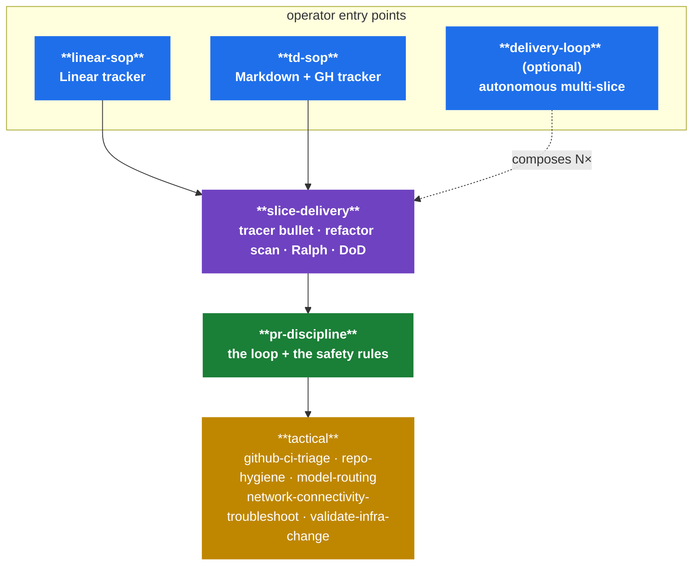

<div align="center">

# 🛠️ Agent Skills

> *A composable harness of reusable, repo-agnostic AgentSkills — small Markdown files that teach a coding agent how to ship work the way a senior engineer would.*

<p align="center">
  
  
  
  
  
</p>

<p align="center">
  <a href="#-skills"><strong>Skills</strong></a> ·
  <a href="#-triggers"><strong>Triggers</strong></a> ·
  <a href="#-composition-engineering"><strong>Composition</strong></a> ·
  <a href="#-design-principles"><strong>Principles</strong></a> ·
  <a href="#-adding-a-skill"><strong>Add a skill</strong></a> ·
  <a href="CONTRIBUTING.md"><strong>Contributing</strong></a>
</p>

<p align="center"><sub><b>15 skills</b> · <b>3 categories</b> · <b>5-skill wave-3 core</b> · tracker = <code>git log --oneline</code></sub></p>

</div>

---

**What this is.** A curated library of [AgentSkills](https://github.com/mattpocock/skills) — single-file Markdown playbooks an LLM coding agent loads on demand. Each skill encodes a *workflow*: when to invoke it, what discipline to apply, what artifact to produce. They layer rather than overlap, so an agent picks the highest layer that fits and lets it delegate downward.

> **Why a library.** *Discipline doesn't survive context resets. Skills do.*

```text
<category>/
  <skill-name>/
    SKILL.md          ← the playbook
    scripts/          ← optional helpers referenced by SKILL.md
```

## 📚 Skills

### 🏗️ Engineering

| Skill | What it owns |
|---|---|
| [`engineering/delivery-loop`](engineering/delivery-loop/SKILL.md) | Multi-slice autonomous wrapper around `slice-delivery`: pre-flight slice queue, per-slice T0 spec-review gate, hard pause conditions, final Definition-of-Done gate. |
| [`engineering/github-ci-triage`](engineering/github-ci-triage/SKILL.md) | Diagnose GitHub Actions / PR check failures with `gh`. |
| [`engineering/linear-sop`](engineering/linear-sop/SKILL.md) | Linear tracker / org workflow: parent-as-lane, sub-issue-as-slice, dependency edges, drift audit. |
| [`engineering/model-routing`](engineering/model-routing/SKILL.md) | Choose model, thinking level, and review lane for delegated work. |
| [`engineering/network-connectivity-troubleshoot`](engineering/network-connectivity-troubleshoot/SKILL.md) | Diagnose public-network, DNS, `gh`, or Tailscale connectivity failures. |
| [`engineering/pr-discipline`](engineering/pr-discipline/SKILL.md) | PR iteration loop + merge safety: open → watch CI → fix → merge, branch protection, lockfiles, auto-merge, force-pushes, stuck PRs. |
| [`engineering/repo-hygiene`](engineering/repo-hygiene/SKILL.md) | Safely inspect stale branches, worktrees, and cleanup candidates. |
| [`engineering/slice-delivery`](engineering/slice-delivery/SKILL.md) | Tracker-agnostic vertical-slice execution: tracer bullets, per-cycle refactor scan, deep modules, TDD scope table, adversarial (Ralph) review, slice lifecycle. |
| [`engineering/td-sop`](engineering/td-sop/SKILL.md) | Tech Dolphins Markdown + GitHub execution wrapper: PRD/build-progress, Mermaid dependency graphs, velocity/rigor/hygiene gates. |
| [`engineering/validate-infra-change`](engineering/validate-infra-change/SKILL.md) | Safely live-smoke Kubernetes/IaC PR changes in dev/staging while preserving GitOps ownership and rollback paths. |

### 🎨 Product

| Skill | What it owns |
|---|---|
| [`product/figma-product-analysis`](product/figma-product-analysis/SKILL.md) | Analyze Figma `.fig` files and design exports for product/workflow/UI specs. |
| [`product/product-inception`](product/product-inception/SKILL.md) | Turn product ideas, legacy assets, and designs into reusable inception docs before implementation. |

### ⚡ Productivity

| Skill | What it owns |
|---|---|
| [`productivity/steam-worksheets`](productivity/steam-worksheets/SKILL.md) | Generate print-ready, full-colour A4 STEAM worksheets (counting, phonics, patterns, mazes, colouring) for early learners. |
| [`productivity/timesheet`](productivity/timesheet/SKILL.md) | Generate a formatted 80-column timesheet from GitHub activity for a date range. |
| [`productivity/writing-great-skills`](productivity/writing-great-skills/SKILL.md) | Reference vocabulary and principles for writing predictable skills (user-invoked; type its name). Vendored from [mattpocock/skills](https://github.com/mattpocock/skills), MIT. |

## 🎯 Triggers

Skills are trigger-oriented — each `description:` enumerates *when* an agent should invoke. The table below is a quick index of representative phrases (a mix of literal trigger tokens lifted from `description:` fields and short paraphrases of the skill's scope) so an operator can scan the surface area at a glance. For the authoritative list, read the linked SKILL.md.

| Representative phrases | Reach for |
|---|---|
| *"ship slice X"*, *"tracer bullet"*, *"refactor scan"*, *"Ralph review"*, *"deep module"* | [`slice-delivery`](engineering/slice-delivery/SKILL.md) |
| *"deliver multiple slices"*, *"execute v0.X"*, *"ship the remaining bullets"* | [`delivery-loop`](engineering/delivery-loop/SKILL.md) |
| *"Linear"*, *"sub-issue"*, *"blocks/blocked-by"*, *"In Review"*, *"linear-sop audit"* | [`linear-sop`](engineering/linear-sop/SKILL.md) |
| *"TD-SOP"*, *"Tech Dolphins"*, *"build-progress"*, *"td-sop-plan"*, *"td:closeout"* | [`td-sop`](engineering/td-sop/SKILL.md) |
| *"PR"*, *"auto-merge"*, *"lockfile"*, *"force-push"*, *"branch protection"*, *"DIRTY"*, *"stuck PR"* | [`pr-discipline`](engineering/pr-discipline/SKILL.md) |
| *"CI is failing"*, *"PR check"*, *"gh status"*, *"smallest fix"* | [`github-ci-triage`](engineering/github-ci-triage/SKILL.md) |
| *"branch cleanup"*, *"orphaned branches"*, *"worktree cleanup"*, *"repo housekeeping"* | [`repo-hygiene`](engineering/repo-hygiene/SKILL.md) |
| *"which model"*, *"spawn"*, *"subagent"*, *"delegate"*, *"escalate to bigger model"*, *"routing decision"* | [`model-routing`](engineering/model-routing/SKILL.md) |
| *"DNS"*, *"Tailscale"*, *"gh failing"*, *"web_fetch failing"*, *"public-network"* | [`network-connectivity-troubleshoot`](engineering/network-connectivity-troubleshoot/SKILL.md) |
| *"smoke"*, *"kubectl-apply"*, *"canary"*, *"validate infra manifests"*, *"Argo self-heal"* | [`validate-infra-change`](engineering/validate-infra-change/SKILL.md) |
| *"make a worksheet"*, *"letter tracing"*, *"counting sheet"*, *"printable for a young kid"* | [`productivity/steam-worksheets`](productivity/steam-worksheets/SKILL.md) |
| *"timesheet"*, *"what did I work on"*, *"GitHub activity for the week"* | [`productivity/timesheet`](productivity/timesheet/SKILL.md) |
| *(user-invoked — type the name)* *"writing-great-skills"*, *"how to write a skill"* | [`productivity/writing-great-skills`](productivity/writing-great-skills/SKILL.md) |
| *"analyze this Figma"*, *".fig file"*, *"design export"* | [`product/figma-product-analysis`](product/figma-product-analysis/SKILL.md) |
| *"product inception"*, *"turn this design into a spec"* | [`product/product-inception`](product/product-inception/SKILL.md) |

## 🧩 Composition (engineering)

The engineering skills are deliberately **layered**, not flat. Operators have three entry points — two tracker SOPs (`linear-sop`, `td-sop`) and the optional autonomous `delivery-loop` — all of which fan into `slice-delivery`. `slice-delivery` owns per-slice execution and delegates PR mechanics to `pr-discipline`. Tactical skills are leaf utilities the higher layers call into.



**How to read this.** Pick the highest layer that fits the task and let it delegate. Tracker SOPs hand off *directly* to `slice-delivery` (one slice at a time). `delivery-loop` is a **parallel** operator entry point — never auto-promoted from `slice-delivery` — that composes `slice-delivery` N times for autonomous multi-slice runs; it is not invoked by the tracker SOPs. Duplication across layers is a refactor trigger — not a feature.

> The ASCII version of this diagram lives in [`CLAUDE.md`](CLAUDE.md#composition-engineering) — that file is loaded into agent context as raw text where Mermaid would just be noise.

## 🧭 Design principles

<details>
<summary><b>The five rules every skill must satisfy.</b> (click to expand)</summary>

- **Generic and parameterized.** No private repo names, local paths, secrets, or user-specific assumptions.
- **Concise.** Cut prose the agent already knows without the skill present. `SKILL.md` is not a tutorial; it's a runbook.
- **Trigger-oriented.** Every `description:` answers *when should the agent invoke this?* — not *what is this about?*
- **Surface destructive candidates before acting.** External writes are explicit and permission-aware.
- **Layered, not overlapping.** A new skill earns its slot only when no existing skill can absorb it.

</details>

## ✍️ Adding a skill

Drop a new `SKILL.md` into the right category folder, declare frontmatter (`name:`, `description:`, `updated:`, optional `wave:`), update the [Skills](#-skills) and [Triggers](#-triggers) tables in the same PR, and post an adversarial review trail before merge.

Full step-by-step in [**CONTRIBUTING.md**](CONTRIBUTING.md). Frontmatter rules and the Ralph contract live in [**CLAUDE.md**](CLAUDE.md).

## 🚫 What not to include

<details>
<summary><b>The four things that get a skill PR rejected.</b> (click to expand)</summary>

- Secrets, tokens, API keys, or private endpoints.
- Repo-specific rules unless the skill is explicitly scoped to that repo.
- Long prose that an agent already knows without the skill.
- Extra files inside a skill folder unless they are used by that skill.

</details>

---

<div align="center">

<sub>📜 [MIT](LICENSE) · ✍️ [Contribute](CONTRIBUTING.md) · 🧠 [Agent operating manual](CLAUDE.md) · 🌊 [Waves](WAVES.md) · 🌱 Inspired by <a href="https://github.com/mattpocock/skills">mattpocock/skills</a></sub>

</div>
