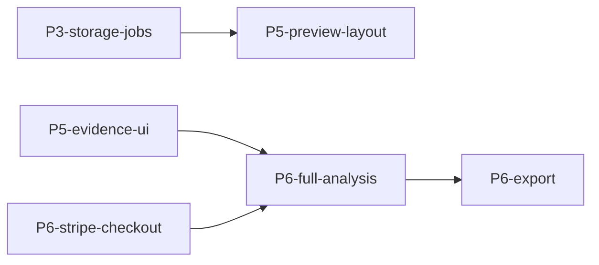

# TD-SOP — Tech Dolphins tracker / org-level workflow

Use this for `Tech-Dolphins-Inc` repos. Do **not** apply Linear-based `linear-sop` assumptions here. Tech Dolphins work uses repo-local Markdown + GitHub + deterministic scripts as the execution system.

**Scope boundary.** This skill owns the *tracker* and *org-level* concerns: PRD, slice queue, build-progress ledger, GitHub Issues policy, Mermaid dependency graphs, hygiene scripts, QA wave gate. It does **not** own per-slice execution — for tracer bullets, deep modules, the per-cycle refactor scan, the TDD scope table, the Ralph review loop, and the slice lifecycle gate, use the `slice-delivery` skill. (Repos may also have a repo-specific overlay, e.g. `ai-national-slice-delivery`.)

## Source-of-truth order

Before non-trivial work, discover and read repo-local equivalents of:

1. `docs/product/prd-v1.md` — build contract.
2. `docs/engineering/td-sop.md` — repo execution contract.
3. `docs/product/td-sop-plan.md` — implementation slice queue.
4. `docs/product/build-progress.md` — mutable tracker and verification ledger.
5. Repo-local scripts such as `td:watch-prs`, `td:closeout`, and `td:qa-smoke` when present.

If these artifacts are absent in a Tech Dolphins repo, establish lightweight equivalents before scaling parallel work.

## Org-level concerns

For per-slice rigor (tracer bullets, deep modules, per-cycle refactor scan, Ralph review loop, slice lifecycle, TDD scope table) → use the `slice-delivery` skill. This skill owns the surrounding org-level concerns:

### Velocity — tracker-level

- Markdown slice = delivery unit. Each slice = one row in `build-progress.md`, one branch/worktree, one PR, one verified merge.
- PRD-first: if implementation needs to deviate from the PRD, update the PRD/tracker first or explicitly defer.
- GitHub Issues are used sparingly (see "When to create GitHub Issues" below). Do not recreate Linear inside GitHub Issues for every implementation slice.
- Model slice dependencies in Markdown, preferably with Mermaid flowcharts when sequencing matters.
- Green owned PRs do not sit idle. Merge or arm auto-merge when local gates + hosted CI + Ralph review imply LGTM.

### Hygiene — repo operability

- Worktrees for parallel agents; main checkout is integration/reference.
- Keep active worktrees <= 4 unless the owner explicitly approves a larger sprint.
- Before starting new work or context-switching, check open PRs, worktree count, branch count, tracker status, and local runtime processes started by prior TD-SOP work.
- After each merge/wave, run closeout/finalizer and return under repo hygiene thresholds.
- Do not leave dev servers, workers, or local dependency stacks running after verification unless the owner explicitly wants them kept alive. When cleaning up, only stop processes whose cwd/command clearly belongs to the repo; never kill an unrelated listener just because it uses the expected port.
- UI/product waves need a fresh QA runtime pass on latest base before expansion/launch claims.

## Markdown + GitHub hybrid tracker

Use Markdown as the build tracker and GitHub Issues as exception tracking.

Recommended artifacts:

- `docs/product/prd-v1.md` — build contract.
- `docs/product/td-sop-plan.md` — slice queue and dependency graph.
- `docs/product/build-progress.md` — mutable status/evidence ledger.
- `docs/engineering/td-sop.md` — repo-specific execution rules.
- GitHub Issues — external blockers, QA bugs, backlog, explicit product/security decisions.

Suggested dependency graph format in `td-sop-plan.md` or a companion section:

Keep the graph small enough to maintain. If it becomes noisy, split by phase.

## Org-level start gate

The per-slice start-lane gate (sync base, read invariants/architecture/DOD, design the public interface, negotiate scope with the user, create the worktree) lives in `slice-delivery`. The two org-level additions on top of it are:

1. Confirm the slice exists in `td-sop-plan.md` (or add it before opening the PR). Meta-DX/process changes with no plan entry must justify themselves in the PR body.
2. Before adding work, run closeout dry-run or the repo-hygiene equivalent and refuse to expand parallel work when hygiene is already out of bounds.

Then hand off to `slice-delivery` for the implementation lifecycle.

## Org-level merge gate

After `slice-delivery`'s lifecycle says the slice is ready, this skill owns the closing tracker/hygiene work:

1. `build-progress.md` is updated in the same PR with status, scope, verification evidence (commit SHA + PR link), and follow-ups. Universal DOD; do not defer to a docs-only closeout PR.
2. Hosted CI green and Ralph dispositions recorded on the PR.
3. Merge.
4. Run closeout/finalizer. Confirm worktrees and branches are back under steady-state thresholds.
5. If part of a UI/product or AI/data wave, run the QA harness against latest `origin/main` and file GitHub Issues for any bugs.

## When to create GitHub Issues

Create a GitHub Issue when the item is durable and should survive beyond a PR branch:

- external dependency/blocker;
- QA bug from smoke/E2E;
- product/security/legal decision;
- post-launch backlog;
- operational task requiring follow-up outside the current PR.

Do not create a GitHub Issue for every implementation slice; the Markdown tracker owns that.

## Extraction guidance

Keep repo-local TD-SOP docs canonical. This skill is a wrapper that tells agents what to read and which gates to enforce. If two or more Tech Dolphins repos converge on the same scripts/artifacts, then promote common pieces into this skill; until then, avoid fossilizing one repo's product-specific details as universal policy.

## Related skills

- **`slice-delivery`** — per-slice execution discipline. This is where tracer bullets, deep modules, the per-cycle refactor scan, the Ralph review loop, and the TDD scope table live. TD-SOP delegates to it.
- `model-routing` — pick the right model/lane before spawning implementation/review subagents.
- `pr-discipline` — PR iteration loop + merge mechanics (rebase, lockfile, auto-merge, branch protection, force-push, stuck PRs).
- `linear-sop` — Linear-based equivalent. Do not use for Tech Dolphins repos unless explicitly comparing processes.
