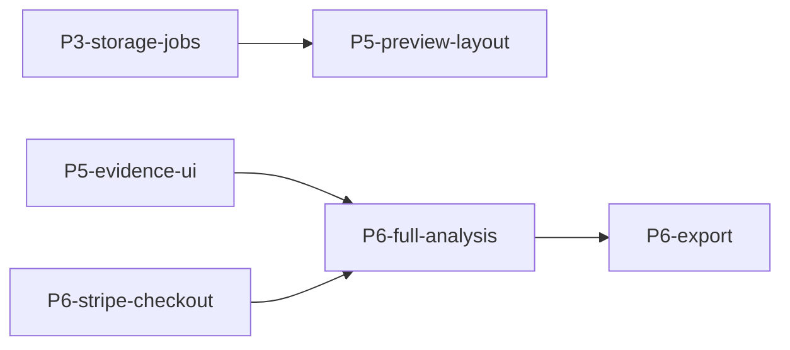

# TD-SOP — Tech Dolphins execution wrapper

Use this for `Tech-Dolphins-Inc` repos. Do **not** apply Linear-based SD-SOP assumptions here. Tech Dolphins work uses repo-local Markdown + GitHub + deterministic scripts as the execution system.

## Source-of-truth order

Before non-trivial work, discover and read repo-local equivalents of:

1. `docs/product/prd-v1.md` — build contract.
2. `docs/engineering/td-sop.md` — repo execution contract.
3. `docs/product/td-sop-plan.md` — implementation slice queue.
4. `docs/product/build-progress.md` — mutable tracker and verification ledger.
5. Repo-local scripts such as `td:watch-prs`, `td:closeout`, and `td:qa-smoke` when present.

If these artifacts are absent in a Tech Dolphins repo, establish lightweight equivalents before scaling parallel work.

## Core invariant: three engineering pillars

### 1. Velocity — small, verifiable chunks

- Markdown slice = delivery unit. Each implementation slice owns exactly one branch/worktree, one PR, one tracker update, and one verified merge.
- PRD-first: if implementation needs to deviate from the PRD, update the PRD/tracker first or explicitly defer.
- Use GitHub Issues sparingly for durable external blockers, QA bugs, post-launch backlog, or product/security decisions. Do not recreate Linear inside GitHub Issues for every implementation slice.
- Model slice dependencies in Markdown, preferably with Mermaid flowcharts when dependencies affect sequencing.
- Green owned PRs do not sit idle: merge or arm auto-merge when local gates + hosted CI + review/meta-review imply LGTM.

### 2. Rigor — prove the change

- Use the repo's fast verification command during iteration.
- Run the repo's full local CI before push/merge readiness.
- Respect Husky/pre-push/commitlint. Do not bypass hooks unless the reason is explicit and documented in the PR.
- Non-trivial PRs need adversarial review while still open; fixes should cite commit hashes and verification evidence.
- UI/product slices require screenshot/smoke evidence plus console/network/app-log checks where relevant.
- AI/data slices require fixtures, expected outputs, eval assertions, and provenance/citation checks.
- Privacy and honesty gates always apply: no fake-live auth/billing/provider/deletion behavior; no raw customer document text in logs.

### 3. Hygiene — keep the repo operable

- Use separate worktrees for parallel agents; keep the main checkout as integration/reference.
- Keep active worktrees <= 4 unless the owner explicitly approves a larger sprint.
- Before starting new work or context-switching, check open PRs, worktree count, branch count, and tracker status.
- After each merge/wave, run closeout/finalizer and return under repo hygiene thresholds.
- UI/product waves need a fresh QA runtime pass on latest base before expansion/launch claims.

## Markdown + GitHub hybrid tracker

Use Markdown as the build tracker and GitHub Issues as exception tracking.

Recommended artifacts:

- `docs/product/prd-v1.md` — build contract.
- `docs/product/td-sop-plan.md` — slice queue and dependency graph.
- `docs/product/build-progress.md` — mutable status/evidence ledger.
- `docs/engineering/td-sop.md` — repo-specific execution rules.
- GitHub Issues — external blockers, QA bugs, backlog, explicit product/security decisions.

Suggested dependency graph format in `td-sop-plan.md` or a companion section:

Keep the graph small enough to maintain. If it becomes noisy, split by phase.

## Start-lane gate

1. Sync main checkout to latest base unless intentionally inspecting old state.
2. Read repo-local TD-SOP docs and current tracker.
3. Check open PRs.
4. Run closeout dry-run or repo-hygiene equivalent and avoid adding work when hygiene is already out of bounds.
5. Pick one PR-sized slice from the plan/tracker.
6. Create a dedicated worktree/branch from latest base.
7. Update the build-progress tracker in the PR with status, scope, verification, PR/commit, and follow-ups.

## PR lifecycle gate

1. Implement one slice only.
2. Run fast local gates during iteration.
3. Run full local CI before push/merge readiness.
4. Open PR with slice ID, scope, non-scope, verification, evidence, dependency note, and tracker update.
5. Post/request adversarial review for non-trivial changes.
6. Address blocking feedback on-branch; reply with fix commits and verification.
7. Watch hosted CI and review until green/LGTM.
8. Merge; verify merged state with the hosting platform.
9. Update tracker to merged if not already included; avoid docs-only closeout PRs unless batching unavoidable reconciliation.
10. Run closeout and QA gates as appropriate.

## When to create GitHub Issues

Create a GitHub Issue when the item is durable and should survive beyond a PR branch:

- external dependency/blocker;
- QA bug from smoke/E2E;
- product/security/legal decision;
- post-launch backlog;
- operational task requiring follow-up outside the current PR.

Do not create a GitHub Issue for every implementation slice; the Markdown tracker owns that.

## Extraction guidance

Keep repo-local TD-SOP docs canonical. This skill is a wrapper that tells agents what to read and which gates to enforce. If two or more Tech Dolphins repos converge on the same scripts/artifacts, then promote common pieces into this skill; until then, avoid fossilizing one repo's product-specific details as universal policy.

## Related skills

- Use a model-routing skill before spawning implementation/review subagents.
- Use a PR-discipline skill for generic PR merge/rebase/lockfile mechanics.
- Do not use Linear-based SD-SOP for Tech Dolphins unless explicitly comparing processes.
